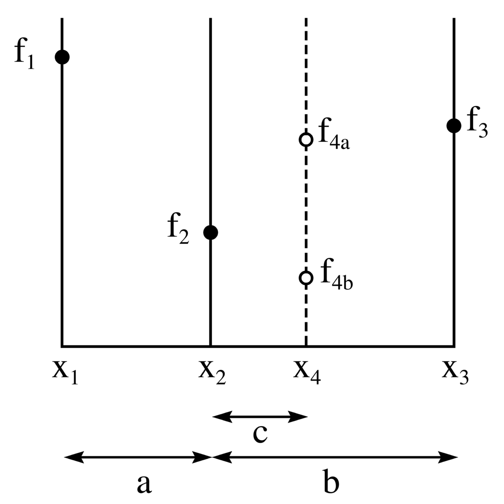

```{r setup, include=FALSE}
#    extra_dependencies: ["float","flafter"]
knitr::opts_chunk$set(echo=FALSE, 
                      message=FALSE, 
                      warning=FALSE, 
                      cache = FALSE,
                      fig.pos = "H", 
                      #out.extra = "",
                      fig.dim = c(11, 7),
                      fig.align='center')

do_run_calc <- FALSE #set this to TRUE to run the R script
if(do_run_calc ) {
  source("RProf_Capstone_MovieLens.R")
} else {
  if(!require(tidyverse)) install.packages("tidyverse", repos = "http://cran.us.r-project.org")
  if(!require(caret)) install.packages("caret", repos = "http://cran.us.r-project.org")
  if(!require(data.table)) install.packages("data.table", repos = "http://cran.us.r-project.org")
  if(!require(lubridate)) install.packages("lubridate", repos = "http://cran.us.r-project.org")
  if(!require(gsubfn)) install.packages("gsubfn", repos = "http://cran.us.r-project.org")
  load("Data/Output_020.RData")
  load("Data/Output_021.RData")
  load("Data/Output_022.RData")
}

```
\newpage
# Introduction
## General Objectives

The MovieLens data set contains the ratings given by users on movies, with additional information on the movie including their genres, title and release year.

The objective of the analysis is to produce rating prediction models that could be used towards a recommendation system for movies,  using the MovieLens data set. This would work as follow: A given user will rate a series of movies. Then based on this information, as well as information gathered on other users ratings, the model will provide a prediction for the ratings the user would have given to movies they have not yet watched. The highest rated such unseen movies would constitute the recommendation. 

Therefore the objective is to build a model that provides the most accurate prediction of the ratings for movies yet unseen by a user.

## Data preparation and usage {#dataprep}

The data set provided was split in a training set (90% of the data) colloquially named *edx* set and *validation* set (10% of the data) without overlap. The *validation* set was then modified to contain only users and movies which are in the training set. The data removed to ensure this, was then added back to the training set. 

The validation set thus defined will be used to provide "unseen" data in the sense defined in the General Objectives.

Using the training data, a series of prediction models will be evaluated and tuned. For the purpose of making choices of model type and parameters tuning to best predict ratings, an iterative process will be used comparing predictions to actual ratings. However, the validation data set will not be used for that process. This is because if it was, it would result in overfitting, that is, a model that best fit the data we are considering but might not generalize well to new data. Instead, **only** the *edx* set will be used both for the purpose of providing training data and providing testing data to measure each model performance. 

The *edx* set will therefore be further split in 10 randomly selected non overlapping folds. Then a training set will be made up of 9 of the folds, with the 10th remaining fold used as test set to estimate the accuracy of the model. Because the 10 folds are non overlapping it is possible to create 10 different [training;test] pairs, resulting in 10 measures of the model and increasing our confidence that results obtained can be generalised to unseen data. 

## Measuring the Model accuracy (RMSE)

The metric used to do that accuracy measurement is the Root Mean Square Error (RMSE) defined as follows:
$$RMSE =\sqrt{\frac{1}{N_{u.i}}\sum_{u,i}(\hat{r_{u,i}}-r_{u,i})^2}$$
where $r_{u,i}$ is the actual rating for movie i, user j and $\hat{r_{u,i}}$ is the corresponding rating estimated using our recommendation system and N the number of user/movie combinations. 

The smaller RMSE is, the better our model is likely to be at predicting a user rating for an unseen movie, hence the better our recommendation system should be.

In the case of classic 10 folds cross validation, used to determine the best model, the RMSE used to do so should be the average of the RMSEs obtained for each fold. However for speed of execution we have applied a simplified method where only the "worst fold" was used to tune the model parameters and RMSE calculated for all folds using the same parameters (See section [Simplified K Folds cross validation] for details) . Checking results over 10 tolds allows to check the variation of RMSE between data set and validate any improvement in RMSE between models beyond what might be an artefact of the particular (training;test) set pair considerd. This further increases the likelihood that the RMSE obtained be also reached on future unseen data, compared to using a single partition of the *edx* set.

## Meeting the challenge objectives

The challenge sets the target RMSE to be reached on the validation set in increasing order of achievement, as follow :

* RMSE > `r rmse_target_10` : worth 5 marks
* `r rmse_target_15` < RMSE < `r rmse_target_10` : worth 10 marks
* `r rmse_target_20` < RMSE > `r rmse_target_15` : worth 15 marks
* `r rmse_target_25` < RMSE < `r rmse_target_20` : worth 20 marks
* RMSE < `r rmse_target_25` : worth 25 marks

Since it is not possible to know whether this will be reached on the *validation* data set (as it is unseen data), we will consider in this study that a particular target is reached, when it is *likely* to be reached on unseen data. Practically we decide that this be the case when **all RMSE values over randomly selected 10 folds are lower than the particular target with a margin**. This assumption is deemed reasonable considering that:

* the validation data set was randomly generated so it is expected to behave in a similar way as the folds
* with a condition that all folds should meet the target, we should have compensated for the effect of sparse data 
* the edx set in its entirety will have more data in it so effects from sparse data for some categories should be less likely
* adding a margin will further reduce the risk the target RMSE be exceeded on unseen data

It is important to note that it is impossible to know for sure how the model will perform on the *validation* set, just estimate how it will perform because it is still possible that the *validation* set is so peculiar that the model does not generalize as well as could be hoped. However considering the above considerations and limitations, this should be unlikely.

# Methods
<!-- a methods/analysis section that explains the process and techniques used, including data cleaning, data exploration and visualization, insights gained, and your modeling approach -->

## Data exploration

### MovieLens Data content

The *edx* set contains a total of `r nb_observations_tot` observations, which have been split as outlined in Section \ref{dataprep} into a training set named edx containing `r nb_observations_edx` observations and a validation set named validation containing `r nb_observations_validation` observations. 

Each observation is made of `r length(edx_varnames)` variables : `r edx_varnames`.

There are `r nb_movies` movies and `r nb_users` users in the edx dataset. 

### Ratings spread

In Figure \ref{fig:ratings-spread}, one can see that the most given ratings is 4, and that whole star ratings are more common than half star ones.  

It also shows that there are no actual ratings above 5 or below 0.5 which therefore appears to be inherent to the grading interface. It implies that any prediction that states a value below 0.5 (resp  greater than 5) will be improved by rounding up (resp down) to 0.5 (resp 5), and so this adjustment should be included in the prediction models. 

We also see that the range of possible values for actual ratings is *[`r seq(0.5,5,0.5)`]*. It would therefore be of value to consider whether rounding predictions to the nearest allowed actual rating would improve results on average. This would likely greatly depend on the accuracy of the prediction on average.

```{r ratings-spread, fig.cap = "Ratings Spread"}
print(p_ratings_spread)
```

Furthermore, it is interesting to consider what the boundaries (minimum and maximum rating) for individual users. This is because if a given user has never given a rating below 2 for instance, it is likely that it will not happen for a new rating by that user. That is, it is likely that for that particular user, a rating of 2 is the minimum it will give to a movie they do not like. This similarly goes for the high ratings. It would be interesting to see whether adjusting for those minimum and maximum ratings for each individual users treating them effectively as new lower and upper boundaries improves predictions on average. 

### Genres spread

In Figure \ref{fig:genres-spread}, one can see that there is a large number of movies for each individual genre, with the most represented genre being Drama followed by Comedy. 

```{r genres-spread, fig.cap = "Nb Movies per Individual Genre"}
print(p_indgenres_spread)
```

## Data cleaning

### Release year extraction

The movie titles contain the release year within brackets at the end of the string, which can be extracted using regular expressions with the pattern "\\((\\d{4})\\)$" which matches a series of 4 digits within brackets immediately preceding the end of the string.

### Individual genres extraction

The data has a genres field which is a string made of the concatenation of individual genres separated by the symbol "|". To extract the effect of each genre, the genres field is split using the unnest function of the tidyr package. 

## Modelling approach

### General Model

We are considering the rating for user u to be modeled by the sum of their usual rating (average rating for user u) plus additional effects likely to make that rating vary away from that average. The effects will be evaluated and the rest of the variation will be considered to be random variation. 

We are considering the rating for movie i and user u to be a result of the average obtained for user u on other movies and for movie i by others with the remainder of the variation explained by random variation. The model can therefore be written as follows:
$$r_{u,i} =\mu+b_i+b_u+\epsilon_{u,i}$$

where $\mu$ is the average rating across all ratings in the training set, $b_i$ is the effect of movie i and $b_u$ is the effect of user u. 

We cannot know the exact values for the parameters but we can estimate the value that will minimise the RMSE. Since in our model we assume that $\epsilon_{u,i}$ is a random error centred around 0, the value that minimise the RMSE will be the average of the non random terms.

The effects are obtained by looking at the deviation from the overall mean when considering the different movies. We calculate $\mu_i$ the averages for each movie i the subtract the overall average $\mu$ giving $b_i$: 
$$\hat{\mu_i} =\frac{1}{N_u}\sum_{u}r_{i,u}$$


$$\hat{b_i} =\hat{\mu_i}-\hat{\mu}=\frac{1}{N_u}\sum_{u}(r_{i,u}-\hat{\mu})$$
We then do the same to obtain $b_u$:
$$\hat{\mu_u} =\frac{1}{N_i}\sum_{i}r_{u,i}$$
$$\hat{b_u} =\hat{\mu_u}-\hat{\mu_i}=\hat{\mu_u}-\hat{\mu}-\hat{b_i}=\frac{1}{N_i}\sum_{i}(r_{u,i}-\hat{\mu}-\hat{b_i})$$

This is one example of effects, but others can be considered such as the genres, or the release year or the time of the day a rating was given, or day of the week, or period of the year.

### Regularisation

Regularisation can also be applied to avoid over fitting the solution in case of a category with a small number of observations, for instance movies with small number of ratings. The average rating for a given movie (resp user) is divided not by the number of users (resp movies) but by this number with a fixed weighting added. This will have the effect to reduce the end value of the deviation to a greater extend for groups with a small number of observations so that overfitting (overtraining) can be avoided and the model generalise better - resulting in better predictions.

Practically we are now trying to minimise the following equation:
$$MSE_\lambda =\frac{1}{N_{u,i}}\sum_{u,i}(r_{u,i}-\hat{\mu}-\hat{b_i}-\hat{b_u})^2+\lambda \left( \sum_{i}b_i^2+\sum_{u}b_u^2 \right) $$


And it can be proven that the minimisation equations becomes:

$$\hat{b_i} =\frac{1}{N_i+\lambda}\sum_{u}(r_{u,i}-\hat{\mu})_i$$

$$\hat{b_u} =\frac{1}{N_u+\lambda}\sum_{i}(r_{u,i}-\hat{\mu}-\hat{b_i})_u$$

One can see from the equations that in general the effect is smaller than it would be without the parameter $\lambda$. In the case where the number of observations is small,that effect reduction will be significant; in the case where the number of observation is large, the term $N_u+\lambda$ will be close to $N_u$.

Supposing we stick to the model with only movie and user effect, we assume that ratings for movie i, user u is:
$$r_{u,i} =\mu+b_i+b_u+\epsilon_{u,i}$$


Which means our estimate of the rating for user u and movie i will be:
$$\hat{r_{u,i}} =\hat{\mu}+\hat{b_i}+\hat{b_u}$$
Each time we decide on a set of effects, we assume that any variation further than those resulting from the effects that have been included thus far (for instance, what the movie is and which user is rating it), can be explained by random variation. 

One matter of consideration is whether one should use a single lambda for all effects, or if there is value in having different lambdas for the different effects. In the the run of the models, both cases will be considered and the choice giving the lowest RMSE will be picked. 

### Further effects

We can further refine the model by considering the remaining variation can be explained by other factors and is not in fact random. 

Further effects can either be applied over the whole set of users to derive an effect that is supposedly common to all users, or for each user individually. The second way will give more accurate effects for an individual user, however only provided that there were enough observations with that particular effect represented, to allow for an accurate effect to be determined. In the worst case scenario there might be no observation for a given individual user for that effect, in which case an effect common to all the uers would have been a better estimate, because of the lack of data.

#### movies genres

Genres will influence the rating of a movie based on users preference. There are a few ways that genres effect can be modeled. A first model could consider the combination of genres as presented in the data, as a genre itself. This however mean that combinations of genres very similar such as Drama|Comedy|Thriller and Drama|Comedy|Action will be treated completely independently, when most likely there is commonality in their effect. Furthermore it will lead to data that is more sparse as the particular combination might not have a lot of observations. 

$$\hat{b_g} =\frac{1}{N_g+\lambda_g}\sum_{i}(r_{u,i}-\hat{\mu}-\hat{b_i}-\hat{b_u})$$


$$\hat{r_{u,i}} =\hat{\mu}+\hat{b_i}+\hat{b_u}+\hat{b_g}$$
An improvement on that model is to separate the individual genres and consider their effect. However by doing so, a given movie with several genres will need to receive an aggregate of the effects of each genre. A proposed model would be to consider for a given movie to get a genres effect that is the average of the effect of each individual genre.

Because the genres are likely to have user specific effect, we extract one such effect per existing user. To simplify the computation, we use the same $\lambda$ for all the individual genres.  

$$\hat{b_{u,indg}} =\frac{1}{N_{indg}+\lambda_{indg}}\sum_{i}(r_{u,i}-\hat{\mu}-\hat{b_i}-\hat{b_u})_{u,indg}$$
$$\hat{b_{u,g}} =mean(\hat{b_{u,indg}})$$
$$\hat{r_{u,i}} =\hat{\mu}+\hat{b_i}+\hat{b_u}+\hat{b_{u,g}}$$

#### movies release date 

As a movie has a single release date the effect is straightforwardly applied by taking the average over all movies of the same release date. Again, because the year preference is likely to be a personal preference, the effect is extracted for each user. 

$$\hat{b_{u,ry}} =\frac{1}{N_{ry}+\lambda_{ry}}\sum_{i}(r_{u,i}-\hat{\mu}-\hat{b_i}-\hat{b_u})_{u,ry}$$

#### rating date 

We can also consider the effect of when the rating was given. This will reflect whether the average rating given by a user varies with time. Again, because a time variation in rating is likely to be specific to each user, the effect is extracted for each user. 

$$\hat{b_{u,t}} =\frac{1}{N_{t}+\lambda_{t}}\sum_{i}(r_{u,i}-\hat{\mu}-\hat{b_i}-\hat{b_u})_{u,t}$$

## Numerical methods 

### Simplified K Folds cross validation

Because we try to minimise the RMSE with lambda as a variable, in K folds cross validation we normally would modify the RMSE function to be the average or median RMSE over the K folds using that lambda parameter. This means we have K times more prediction function evaluation to carry out. Furthermore in some of the models there might be value in using different lambdas for each effects. This can be numerically demanding resulting in a very long run time. 

For this reason, a simpler method was chosen, which is to determine the minimising lambda only for one of the folds, then apply this lambda to all folds to obtain the 10 RMSEs, as a way to check that the RMSE did overall vary in the same direction across models. 

The choice for the particular fold to use was to pick the fold that gave the highest RMSE values among all folds, for the model that on average over the 10 folds gave the lowest RMSE over the models considered thus far. In other words, the "worst" fold for the "best" model. This was because it was considered that the likelihood that the lambda chosen has an impact was considered greater in the cases where the RMSE would be the highest. Therefore it could be supposed that this might improve the most results for data yet unseen. 

Because of this simplification it will be necessary to check whether indeed each model bringing improvement in the RMSE over the worst fold, will also bring similar improvement on all other folds.

### Function minimisation : Golden section search

Even with the simplification of determining only the lambda(s) minimising the worst fold, it still remains that the determination of lambda can be long if a specific precision is to be reached. A method was chosen that allowed to get to the minimum RMSE for a given model within a chosen precision with as little function evaluations as possible. 

The basic method is to pick a minimum and maximum lambda and then pick 2 lambda values between those first two guesses to find lambda values that:

* yield a lower RMSE than both the minimum and maximum lambda
* provide a new interval between which to search for new lambdas further minimising the function
* has a consistent lambda spacing to optimise the search and reduce function evaluations

The method chosen was to apply the golden section search. 

For a function f of the monovariate variable x, for which we are searching for a minimum between two values Xmin and Xmax, we pick two further x values that are spaced so that the golden ratio is applied between the two inner and outer values. See Figure \ref{fig:goldenratiofig} ^[(copyright [CC BY-SA 3.0](https://creativecommons.org/licenses/by-sa/3.0/) [PAR](https://commons.wikimedia.org/wiki/User:PAR~commonswiki))] for a diagram of the search. 

```{r label = goldenratiofig,fig.cap="\\label{fig:goldenratiofig}Golden Section Search",  dpi=300}

```

Practically we pick the x values so that the ratios are:

$$\varphi =  \frac{c}{a} = \frac{c}{b-c} = \frac{a}{b} $$

It can be proven that this is the case if $\varphi$ is the golden ratio defined as:

$$\varphi = \frac{1+\sqrt5}{2} $$

Once the values of $x_2$ and $x_4$ are calculated, we evaluate f at those points. Then, if f4 is greater (resp lower) than f2 , the new search interval becomes $[x_1;x_4]$ (resp $[x_2;x_3]$). We then select the new x value in the $[x_1;x_2]$ (resp $[x_2;x_3]$) interval that the golden ratio is again met. 

More details on this method can be found at the following wikipedia page  [Golden Section Search - Wikipedia](https://en.wikipedia.org/wiki/Golden-section_search) and the implementation of the function in R is in the HELPER FUNCTIONS DEFINITION section of the RProf_Capstone_MovieLens R script. 

Example of the method used in the context of this study can be found in section [RMSE function Minimum Search].

# Results

## Simplified Cross Validation Results

### Summary

```{r eval = TRUE}
library(tidyverse)
#TODO make all numerical results extracted from R results
index_min_RMSE <- rmse_folds_results_summary$median_RMSE == min(rmse_folds_results_summary$median_RMSE)
method_min_RMSE <- rmse_folds_results_summary$method[index_min_RMSE]

method_min_RMSE_nonreg <- rmse_folds_results_summary %>%
  ungroup() %>%
  filter(!str_detect(string = method,pattern = "reg")) %>%
  slice_min(median_RMSE,n = 1,with_ties = FALSE) %>%
  pull(method)

index_min_RMSE_nonreg <- rmse_folds_results_summary$method == method_min_RMSE_nonreg


```

The best model considered is one that incorporates the following effects: *`r rmse_folds_results_summary$method[index_min_RMSE]`* achieving a median RMSE of *`r rmse_folds_results_summary$median_RMSE[index_min_RMSE]`* with a maximum RMSE of **`r  rmse_folds_results_summary$max_RMSE[index_min_RMSE]`** obtained on `r worst_fold_best_method`. 

The best model without regularisation incorporates the following effects: `r method_min_RMSE_nonreg` achieving a median RMSE of *`r rmse_folds_results_summary$median_RMSE[index_min_RMSE_nonreg]`* with a maximum RMSE of **`r  rmse_folds_results_summary$max_RMSE[index_min_RMSE_nonreg]`** obtained on `r worst_fold_best_method`. 

Since every fold out of the 10 randomly generated Folds on the training data beat the lowest target RMSE = `r rmse_target_25` we achieved the objective set in section [Meeting the challenge objectives] for a reasonable expectation to beat the target on future unseen data for both of those models.

The following models also achieved the objective set to beat the lowest target RMSE:

```{r, results='asis'}
methods_betterthantarget <- rmse_folds_results_summary %>% 
  ungroup() %>%
  filter(!(method %in% c(method_min_RMSE,method_min_RMSE_nonreg))) %>%
  filter(max_RMSE < rmse_target_25) %>%
  mutate(method_result_string = paste0(method," (max_RMSE = **",round(max_RMSE,5),"**)")) %>%
  pull(method_result_string)

for (method_result_string in methods_betterthantarget){
  cat("*", method_result_string, "\n")
}
```

The full simplified cross validation results for the models considered can be found in Table \ref{tab:results-table} and Table \ref{tab:results-summary-table}, ordered by descending mean RMSE (increasing mean prediction accuracy) over the 10 folds randomly generated, and located in the [Full Simplified Cross Validation Results] section of the [Appendix].

### Visualisations

Figure \ref{fig:rmse-bestmethods-boxplot} is the plot of all models RMSE for all folds with boxplot superimposed. The target RMSE are drawn as horizontal lines with the following colours:

* RMSE = `r rmse_target_10` : red
* RMSE = `r rmse_target_15` : orange
* RMSE = `r rmse_target_20` : blue
* RMSE = `r rmse_target_25` : green

```{r label = rmse-bestmethods-boxplot, fig.cap = "RMSE variation with models"}
#, out.extra='angle = 90'
print(p_rmse_bestmethods_boxplot)
```

Figure \ref{fig:rmse-bestmethods-boxplot-zoom} is the same plot, with only the models with RMSE below 0.88. It shows clearly that a model just including movie+users even with regularisation does not allow to achieve the RMSE target of `r rmse_target_25` for all folds, so makes the case to have considered more complex models with additional effects. 

It also shows that the lowest target RMSE of *`r rmse_target_25`* is beaten with a significant margin by 5 of the models. 

```{r label = rmse-bestmethods-boxplot-zoom, fig.cap = "RMSE variation with models (below 0.88 RMSE only)"}
#, out.extra='angle = 90'
print(p_rmse_bestmethods_boxplot_zoom)
```

It also provides verification that the simplified cross validation method described in section [Simplified K Folds cross validation] is valid indeed for each model, all 10 folds are within roughly the same RMSE interval with a standard deviation of around 0.00075 and follow the same variation in RMSE from model to model. It is even more clear when drawing each fold variation across models as a line plot in Figure \ref{fig:rmse-bestmethods-pointline} that tuning on the worst fold does improve the results on all folds in a very similar manner.

```{r label = rmse-bestmethods-pointline, fig.cap = "RMSE variation for each fold (below 0.88 RMSE only)"}
print(p_rmse_bestmethods_pointline)
```

## Final model prediction on validation set

Using the best models derived, it is now possible to calculate the RMSE on the unseen data contained in the *validation* set. To do so, the model is trained one last time on the whole *edx* (training) set, using the lambda parameter previously derived from simplified cross validation on the worst fold (fold01) (with verification on the other 9 folds), then a prediction is made on the *validation* set for which we calculate the RMSE. 

Doing so yields the following result: 

* **`r final_pred_RMSE`** for the *movie+user+indgenres+releaseyear+timestamp reg* model 
* **`r final_pred_fast_RMSE`** for the *movie+user+indgenres* model 

Both models do beat the lowest target RMSE of *`r rmse_target_25`* by a significant margin. 

Also we observe that both RMSE values are lower than the RMSE obtained on the "worst fold" during the 10 folds simplified cross validation. 

This reinforces the idea that the proposed method to use the worst fold to provide a conservative estimate of what to expect on unseen data and to tune the regularised models parameters on that worst fold, was reasonable. 

The prediction on the validation set was was produced *`r round(as.double(duration)/as.double(duration_fast),2)`* times slower for the regularised model compared to the non regularised model. To this should be added the time required to tune the lambda parameters of the regularised model during simplified cross validation. This highlights that depending on the target RMSE choices the non regularised model appears like a good choice if speed of execution is a factor.

# Conclusion and Future Work

Using a model that incorporated the effects of movie, user, date of rating, individual genres and release year to account for the variation in ratings, it was possible to reach predictions in movie ratings for unseen data with a RMSE below 0.85, beating the lowest RMSE target of `r rmse_target_25`.

The exploration of models has shown that regularisation brings improvement in predictions. Furthermore it was observed that using different lambda parameters for the different effects can bring further improvements in some cases. The effect of rounding predictions to the nearest allowed values ws considered but did not bring improvements. However considering the boundaries of the ratings for each user, it was possible to reduce the RMSE. See section [Refinements brought to Models] for more details.

Further improvement might be possible by using full cross validation whereby the lambda values are obtained by minimising a modified RMSE function that gives the average of the RMSE across the folds. This was not done, in order to shorten the run times of the training of the models (since each modified RMSE evaluation would require a number of computation K times higher, if K is the number of folds). 

Further models could also be used to reach further reduction in RMSE, such as matrix factorisation applied on the residuals of the best model. 

It would also be of value to consider what happens when sparse data is not removed from the training set. That is, when we allow for data in the validation set to contain both movies and users which are not present in the training set. This would be a more general situation closer to reality as it would correspond to new movies added to the library or new users joining the system. 

# Appendix 

## Refinements brought to Models
### Rating Rounding / Adjustments

As discussed in section [Ratings spread], The possible values for user given ratings are discrete and the possible values are: *[`r seq(0.5,5,0.5)`]*.

There was one more applied adjustment to the predictions based on the allowed interval that was an immediate win. Indeed for models that have more than one effect, the prediction can end up being outside of the possible interval for actual rating. Taking the first model with two effects, movie+users, we find that for the worst fold, the number of predictions which are lower than 0.5 or higher than 5 is *`r nb_pred_outofrange`* out of *`r nb_pred_total`*. We therefore adjust any rating below 0.5 to 0.5 and any rating above 5 to 5. Adjusting for global boundary reduced the RMSE from the original *`r RMSE_movie_user`* to *`r RMSE_movie_user_globalboundary`*. We then also checked that applying user boundary after global boundary adjustment gave a further reduction in RMSE, which was the case as we reached a RMSE of *`r RMSE_movie_user_globalthenuserboundary`*. This was done because in cases where a user has not rated movies yet there will be no rating boundary information available.

We considered the effect of rounding the results to the nearest allowed ratings but this did not bring improvements. The movie model without any rounding yielded a RMSE of *`r RMSE_movie`* while the rounded model yielded a higher RMSE of *`r RMSE_movie_rounded`* when applying rounding only to the nearest whole rating, for users who had only given whole ratings, and only for predictions that were within 0.1 of a whole rating.

Next we considered the effect of user boundaries in their ratings. We rounded all predictions down (resp up) to the user maximum (resp minimum) rating given thus far if they were found to be greater (resp lower) than that user maximum (resp minimum) rating. This was based on the assumption that each user might have their idea of what is a maximum and minimum rating, keeping to this rather than the full range. By doing so, we yielded a *lower* RMSE of *`r RMSE_movie_userboundary`*. As a result we applied this adjustment for all further models without specifying it in the model descriptions for conciseness. 

We also applied adjustment on the predictions based on the allowed interval that was an immediate win. Indeed for models that have more than one effect, the prediction can end up being outside of the possible interval for actual rating. Taking the first model with two effects, movie+users, we found that for the worst fold, the number of predictions which are lower than 0.5 or higher than 5 is *`r nb_pred_outofrange`* out of *`r nb_pred_total`*. We therefore adjusted any rating below 0.5 to 0.5 and any rating above 5 to 5. Adjusting for global boundary reduced the RMSE from the original *`r RMSE_movie_user`* to *`r RMSE_movie_user_globalboundary`*. We then also checked that applying user boundary after global boundary adjustment gave a further reduction in RMSE, which was the case as we reached a RMSE of *`r RMSE_movie_user_globalthenuserboundary`*. This was done because in cases where a user has not rated movies yet there will be no rating boundary information available.

Considering the above, for all models with more than one effect, we have applied global then user boundary adjustment, without specifying it in the model descriptions for conciseness.

### Multiple Lambda vs Single Lambda Regularisation

When considering models that were regularised, we have considered two cases: 

* a single lambda parameter was used across all effects
* one specific lambda parameter for each new effect when adding a new effect

```{r label = SingleVsMultipleLambdaComp-table}
library(knitr)
library(kableExtra)

SingleVsMultipleLambdaComp_table <- SingleVsMultipleLambdaComp %>%
  mutate(BestModel = if_else(SingleLambdaRMSE < MultipleLambdaRMSE,"Single Lambda","Multiple Lambdas"))

kable(x=SingleVsMultipleLambdaComp_table,caption=paste("Single vs Multiple Lambda RMSE Comparison")) %>%
  kable_styling(full_width = F) %>%
  kable_styling(latex_options = c("striped", "HOLD_position","repeat_header"),
                repeat_header_continued = T)

```

Results were found to be better with a single Lambda for the following models : 

```{r, results='asis'}
methods_singlelambdabetter <- SingleVsMultipleLambdaComp_table%>% 
  filter(BestModel == "Single Lambda") %>%
  pull(method)

for (method_result_string in methods_singlelambdabetter){
  cat("*", method_result_string, "\n")
}
```

Results were found to be better with multiple lambdas for the following models:

```{r, results='asis'}
methods_multiplelambdabetter <- SingleVsMultipleLambdaComp_table%>% 
  filter(BestModel == "Multiple Lambdas") %>%
  pull(method)
for (method_result_string in methods_multiplelambdabetter){
  cat("*", method_result_string, "\n")
}
```

In all regularised models, we reported the version (single  or multiple lambdas) that gave the lowest RMSE.


\newpage
\blandscape

## Full Simplified Cross Validation Results

Similarly to the [Visualisations] section, we have colour coded the RMSE results, as follow :

* RMSE > `r rmse_target_10` : black
* `r rmse_target_15` < RMSE < `r rmse_target_10` : red
* `r rmse_target_20` < RMSE > `r rmse_target_15` : orange
* `r rmse_target_25` < RMSE < `r rmse_target_20` : blue
* RMSE < `r rmse_target_25` : green


```{r label = results-table}
library(knitr)
library(kableExtra)
library(tidyverse)

  # rmse_target_25 <- 0.86490
  # rmse_target_20 <- 0.86499
  # rmse_target_15 <- 0.86549
  # rmse_target_10 <- 0.89999

rmse_folds_results_table <- rmse_folds_results %>%
  select(-do_remove_sparse,-get_pred_func_name) %>%
  mutate(across(where(is.double), function(x) {round(x,5)}))

names(rmse_folds_results_table) <- c("method",paste("Fold",seq(10)))


rmse_folds_results_table$`Fold 1` = cell_spec(
  rmse_folds_results_table$`Fold 1`,
  #color = "gray",
  color = case_when(rmse_folds_results_table$`Fold 1` < rmse_target_25~ "#009933",
                    rmse_folds_results_table$`Fold 1` < rmse_target_20~ "#0099ff",
                    rmse_folds_results_table$`Fold 1` < rmse_target_15~ "#ff6600",
                    rmse_folds_results_table$`Fold 1` < rmse_target_10~ "#cc0000",
                     TRUE~ "black") 
  )
rmse_folds_results_table$`Fold 2` = cell_spec(
  rmse_folds_results_table$`Fold 2`, 
  #color = "gray",
  color = case_when(rmse_folds_results_table$`Fold 2` < rmse_target_25~ "#009933",
                    rmse_folds_results_table$`Fold 2` < rmse_target_20~ "#0099ff",
                    rmse_folds_results_table$`Fold 2` < rmse_target_15~ "#ff6600",
                    rmse_folds_results_table$`Fold 2` < rmse_target_10~ "#cc0000",
                     TRUE~ "black") 
  )
rmse_folds_results_table$`Fold 3` = cell_spec(
  rmse_folds_results_table$`Fold 3`, 
  #color = "gray",
  color = case_when(rmse_folds_results_table$`Fold 3` < rmse_target_25~ "#009933",
                    rmse_folds_results_table$`Fold 3` < rmse_target_20~ "#0099ff",
                    rmse_folds_results_table$`Fold 3` < rmse_target_15~ "#ff6600",
                    rmse_folds_results_table$`Fold 3` < rmse_target_10~ "#cc0000",
                     TRUE~ "black") 
  )
rmse_folds_results_table$`Fold 4` = cell_spec(
  rmse_folds_results_table$`Fold 4`, 
  #color = "gray",
  color = case_when(rmse_folds_results_table$`Fold 4` < rmse_target_25~ "#009933",
                    rmse_folds_results_table$`Fold 4` < rmse_target_20~ "#0099ff",
                    rmse_folds_results_table$`Fold 4` < rmse_target_15~ "#ff6600",
                    rmse_folds_results_table$`Fold 4` < rmse_target_10~ "#cc0000",
                     TRUE~ "black") 
  )
rmse_folds_results_table$`Fold 5` = cell_spec(
  rmse_folds_results_table$`Fold 5`, 
  #color = "gray",
  color = case_when(rmse_folds_results_table$`Fold 5` < rmse_target_25~ "#009933",
                    rmse_folds_results_table$`Fold 5` < rmse_target_20~ "#0099ff",
                    rmse_folds_results_table$`Fold 5` < rmse_target_15~ "#ff6600",
                    rmse_folds_results_table$`Fold 5` < rmse_target_10~ "#cc0000",
                     TRUE~ "black") 
  )
rmse_folds_results_table$`Fold 6` = cell_spec(
  rmse_folds_results_table$`Fold 6`, #color = "gray",
  color = case_when(rmse_folds_results_table$`Fold 6` < rmse_target_25~ "#009933",
                    rmse_folds_results_table$`Fold 6` < rmse_target_20~ "#0099ff",
                    rmse_folds_results_table$`Fold 6` < rmse_target_15~ "#ff6600",
                    rmse_folds_results_table$`Fold 6` < rmse_target_10~ "#cc0000",
                     TRUE~ "black") 
  )
rmse_folds_results_table$`Fold 7` = cell_spec(
  rmse_folds_results_table$`Fold 7`, #color = "gray",
  color = case_when(rmse_folds_results_table$`Fold 7` < rmse_target_25~ "#009933",
                    rmse_folds_results_table$`Fold 7` < rmse_target_20~ "#0099ff",
                    rmse_folds_results_table$`Fold 7` < rmse_target_15~ "#ff6600",
                    rmse_folds_results_table$`Fold 7` < rmse_target_10~ "#cc0000",
                     TRUE~ "black") 
  )
rmse_folds_results_table$`Fold 8` = cell_spec(
  rmse_folds_results_table$`Fold 8`, #color = "gray",
  color = case_when(rmse_folds_results_table$`Fold 8` < rmse_target_25~ "#009933",
                    rmse_folds_results_table$`Fold 8` < rmse_target_20~ "#0099ff",
                    rmse_folds_results_table$`Fold 8` < rmse_target_15~ "#ff6600",
                    rmse_folds_results_table$`Fold 8` < rmse_target_10~ "#cc0000",
                     TRUE~ "black") 
  )
rmse_folds_results_table$`Fold 9` = cell_spec(
  rmse_folds_results_table$`Fold 9`, #color = "gray",
  color = case_when(rmse_folds_results_table$`Fold 9` < rmse_target_25~ "#009933",
                    rmse_folds_results_table$`Fold 9` < rmse_target_20~ "#0099ff",
                    rmse_folds_results_table$`Fold 9` < rmse_target_15~ "#ff6600",
                    rmse_folds_results_table$`Fold 9` < rmse_target_10~ "#cc0000",
                     TRUE~ "black") 
  )
rmse_folds_results_table$`Fold 10` = cell_spec(
  rmse_folds_results_table$`Fold 10`, #color ="gray",
  color = case_when(rmse_folds_results_table$`Fold 10` < rmse_target_25~ "#009933",
                    rmse_folds_results_table$`Fold 10` < rmse_target_20~ "#0099ff",
                    rmse_folds_results_table$`Fold 10` < rmse_target_15~ "#ff6600",
                    rmse_folds_results_table$`Fold 10` < rmse_target_10~ "#cc0000",
                     TRUE~ "black") 
  )
options(digits = 5)   # report 3 significant digits

  kable(x=rmse_folds_results_table,
        caption=paste("10 Folds RMSE results"), escape = F) %>%
  kable_styling(full_width = F) %>%
  kable_styling(latex_options = c(#"striped", 
                                  "HOLD_position",
                                  "repeat_header"))

```

\elandscape
\newpage

```{r label = results-summary-table}
library(knitr)
library(kableExtra)

rmse_folds_results_summary_table <- rmse_folds_results_summary %>%
  select(-do_remove_sparse) %>% 
  rename(mean = mean_RMSE,
         median = median_RMSE,
         max = max_RMSE,
         sd = sd_RMSE) %>%
  mutate(across(where(is.double), function(x) {round(x,5)}))
# 
rmse_folds_results_summary_table$mean = cell_spec(
  rmse_folds_results_summary_table$mean,
  #color ="gray",
  color = case_when(rmse_folds_results_summary_table$mean < rmse_target_25~ "#009933",
                    rmse_folds_results_summary_table$mean < rmse_target_20~ "#0099ff",
                    rmse_folds_results_summary_table$mean < rmse_target_15~ "#ff6600",
                    rmse_folds_results_summary_table$mean < rmse_target_10~ "#cc0000",
                     TRUE~ "black") 
  )
rmse_folds_results_summary_table$median = cell_spec(
  rmse_folds_results_summary_table$median,
  #color ="gray",
  color = case_when(rmse_folds_results_summary_table$median < rmse_target_25~ "#009933",
                    rmse_folds_results_summary_table$median < rmse_target_20~ "#0099ff",
                    rmse_folds_results_summary_table$median < rmse_target_15~ "#ff6600",
                    rmse_folds_results_summary_table$median < rmse_target_10~ "#cc0000",
                     TRUE~ "black") 
  )
rmse_folds_results_summary_table$max = cell_spec(
  rmse_folds_results_summary_table$max,
  #color ="gray",
  color = case_when(rmse_folds_results_summary_table$max < rmse_target_25~ "#009933",
                    rmse_folds_results_summary_table$max < rmse_target_20~ "#0099ff",
                    rmse_folds_results_summary_table$max < rmse_target_15~ "#ff6600",
                    rmse_folds_results_summary_table$max < rmse_target_10~ "#cc0000",
                     TRUE~ "black") 
  )

options(digits = 5)   # report 3 significant digits
kable(x=rmse_folds_results_summary_table,
      caption=paste("10 Folds RMSE results Summary"),escape = F
      ) %>%
  kable_styling(full_width = F) %>%
  kable_styling(latex_options = c(#"striped", 
                                  "HOLD_position","repeat_header"),
                repeat_header_continued = T)

```

## RMSE function Minimum Search

### Extensive Search

We compare the minimum RMSE search methods. The first approach is to extensively search for the minimizing lambda by calculating the RMSE for a series of lambda until a minimum is reached. For the *movie reg* model, we get the following search graph. 

```{r, fig.cap = "Extensive Minimum Search"}
  #Visualisations of systematic lambda search
  RMSE_movie_extensive_minimum_search %>%
    mutate(Category = "Minimum_Search") %>%
    ggplot(aes(Lambda, RMSE,colour = Category)) +
    geom_line() + geom_point() +
    geom_point(data = RMSE_movie_extensive_minimum_search %>% filter(RMSE == min(RMSE)) %>% mutate(Category = "Minimum"), size = 2, stroke = 2)
```

### Golden Section Search

In the golden search method, we start with 4 lambda values with the minimum and maximum being the start and end of the search interval, and the two middle lambda values picked so that the golden ratio is met. 

The advantage is that each further step in the search only requires a single RMSE function evaluation. Overall, we reach a minimum after *`r length(unique(Details_Lambda_Min_RMSE_worst_fold_m$SearchRecord$X))`* function evaluations. 

```{r, fig.cap = "Golden Seaction Search Method - Steps Faceted"}
#Visualisations of lambda search
  #search steps visualisations - using facets
  Details_Lambda_Min_RMSE_worst_fold_m$SearchRecord %>%
    mutate(step = as.character(step)) %>%
    ggplot(aes(X, Val,group = step)) +
    geom_line(aes(colour = step)) +
    geom_point(alpha = 0.5) + facet_grid(step~.) +
    theme(legend.position = c(0.8, 0.2))
```


```{r, fig.cap = "Golden Seaction Search Method - Steps Superimposed"}
#search steps visualisations - using dodged line plots
  Details_Lambda_Min_RMSE_worst_fold_m$SearchRecord %>%
    mutate(step = as.character(step)) %>%
    ggplot(aes(X, Val)) +
    geom_line(#position = position_dodge(width = 0.5),
              size = 1,
              aes(colour = step)) +
    geom_point() +
    theme(legend.position = c(0.8, 0.2))
```


```{r, fig.cap = "Golden Seaction Search Method - All Values"}
#search steps visualisations - line and point plot
  Details_Lambda_Min_RMSE_worst_fold_m$SearchRecord %>%
    ggplot(aes(X, Val)) +
    geom_point() +
    geom_line()
```

### Search method comparison

```{r label = Search-Method-Comparison, fig.cap = "Search Method Comparison"}
# ggplot(Comp_SearchMethods%>% filter(Category  == "Extensive_Search"), aes(Lambda, RMSE,colour = Category ,shape = Category )) + 
#     geom_line() +
#     geom_point(size = 1) +
#     geom_point(data = Comp_SearchMethods%>% filter(Category  == "Golden_Section_Search"),size = 2,stroke = 2)+
#     geom_point(data = Comp_SearchMethods%>% filter(Category  == "Golden_Section_Search") %>% filter(RMSE == min(RMSE)) %>% mutate(Category  = "Golden_Section_Minimum"),size = 2,stroke = 2)+
#     geom_point(data = Comp_SearchMethods%>% filter(Category  == "Extensive_Search") %>% filter(RMSE == min(RMSE)) %>% mutate(Category  = "Extensive_Minimum"),size = 2,stroke = 2)

  ggplot(Comp_SearchMethods%>% filter(Category  == "Extensive_Search"), 
         aes(Lambda, RMSE,colour = Category ,shape = Category )) + 
    #geom_line() +
    geom_point(size = 1, stroke =1) +
    geom_point(data = Comp_SearchMethods%>% filter(Category  == "Golden_Section_Search"),size = 1,stroke = 2)+
    geom_point(data = Comp_SearchMethods%>% filter(Category  == "Golden_Section_Search") %>% filter(RMSE == min(RMSE)) %>% mutate(Category  = "Golden_Section_Minimum"),size = 2,stroke = 2)+
    geom_point(data = Comp_SearchMethods%>% filter(Category  == "Extensive_Search") %>% filter(RMSE == min(RMSE)) %>% mutate(Category  = "Extensive_Minimum"),size = 2,stroke = 2)
  

```

In figure \ref{fig:Search-Method-Comparison} the advantage of using the Golden Section search is quite clear since with only *`r length(unique(Details_Lambda_Min_RMSE_worst_fold_m$SearchRecord$X))`* RMSE function evaluations we do reach a minimum RMSE of *`r min(Details_Lambda_Min_RMSE_worst_fold_m$SearchRecord$Val)`* which is virtually identical to the one found for the Extensive Search method (*`r RMSE_movie_systematic`*), while that latter method requires *`r nrow(RMSE_movie_extensive_minimum_search)`* RMSE function evaluations (*`r round((nrow(RMSE_movie_extensive_minimum_search))/(length(unique(Details_Lambda_Min_RMSE_worst_fold_m$SearchRecord$X))),2)`* as many evaluations).

### Golden Section Search Limitations : search interval

One can see from the definition of the method that for it to progress it requires the values at XLeft and XRight to be such that there is a minimum found at step number 1 of the search. But this might not be the case, depending on the search interval chosen! Figure \ref{fig:p-LargerInterval-SearchRecordComparison} below is an example of such a case, using the *movie reg* model. By choosing the search interval to be *[0-50]* step 1 picks values of lambda which do not show a minimum. 

To alleviate this issue, the function was improved to allow for further attempts finding a minimum in case of initial failure. If a function is found to be absolutely increasing at step 1, then further attempt is made to find a minimum between XMin and XLeft, since this is the only interval where such a minimum will be if it exists. It is then possible to find the minimum even if the initial interval chosen is quite large provided that enough attempts are made. Figure \ref{fig:p-LargerInterval-SearchRecordComparison} below shows that allowing two further such attempts results in finding the minimum. 

\newpage
\blandscape

```{r  label = p-LargerInterval-SearchRecordComparison, fig.cap = "Larger Interval Search Limitation and Resolution"}
p_LargerInterval_SearchRecordComparison
```

\elandscape